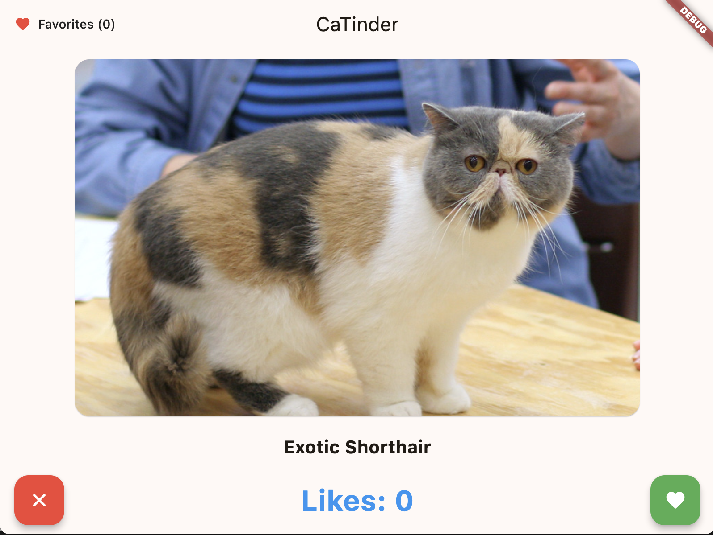
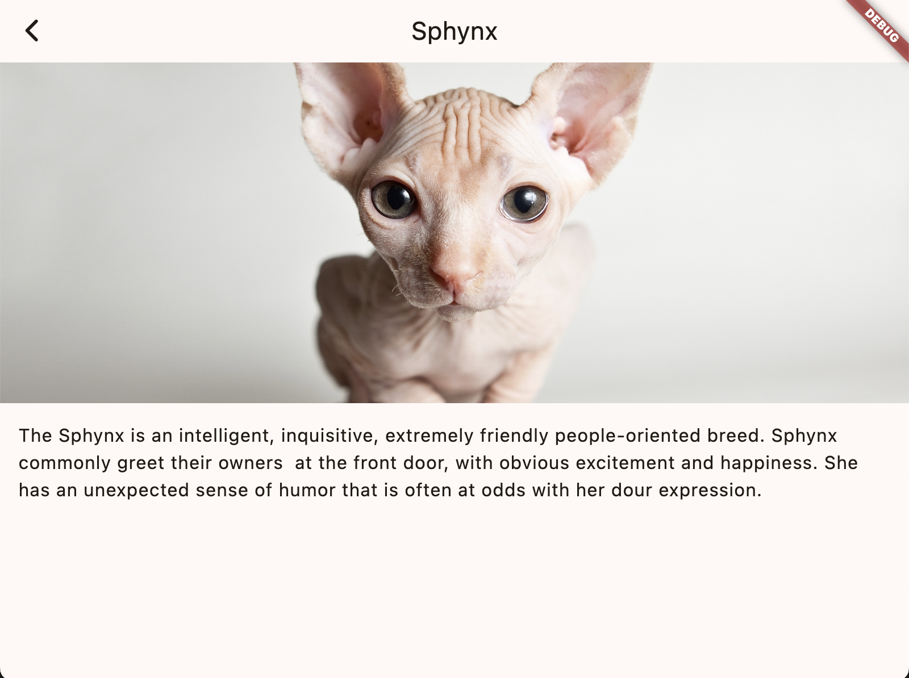
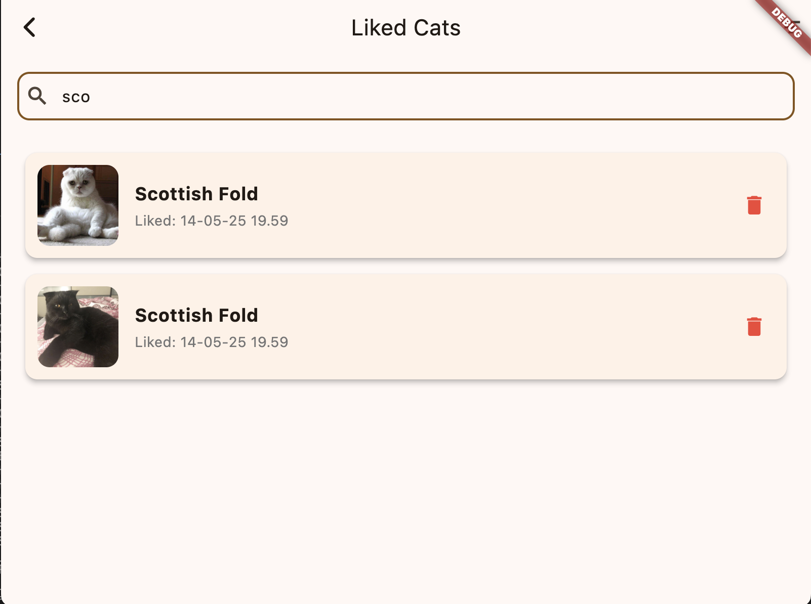
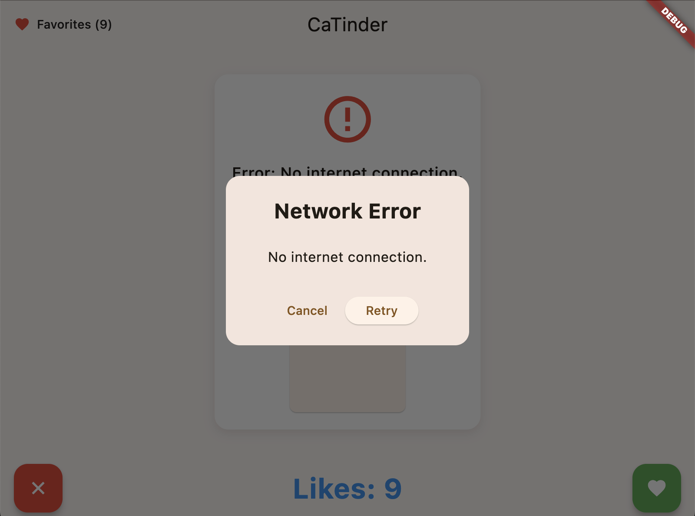

# Catinder 🐱

Мобильное приложение для знакомства с котиками! Свайпайте вправо, если котик понравился, и влево, если нет.

## Установка

### Скачать APK

<a href="releases/latest/catinder.apk?raw=true" download>
  
</a>

### Собрать из исходников

```bash
git clone https://github.com/Inteshil/catinder.git
cd catinder
flutter pub get
flutter run
```

## Особенности приложения

- 🐱 Просмотр случайных котиков разных пород
- 👆 Удобные свайпы для оценки котиков
- ❤️ Подсчет количества понравившихся котиков
- 🖼️ Кэширование изображений для быстрой загрузки
- 🔍 Детальная информация о каждой породе
- 📝 Экран лайкнутых котиков с возможностью удаления

## Экран лайкнутых котиков

- Отображает список всех лайкнутых котиков
- Список скроллится
- Информация о котике: изображение, порода, дата лайка
- Возможность удаления карточки из списка

## Фильтрация

- Выпадающий список пород
- Поиск по породе
- Мгновенное обновление списка

## Обработка ошибок

- Экран загрузки
- Диалог с ошибкой при ошибке сети

## Скриншоты

<table>
  <tr>
    <td></td>
    <td></td>
    <td></td>
    <td></td>
  </tr>
</table>

## Технологии

- Flutter & Dart
- The Cat API для получения данных о котиках
- Http для работы с сетью
- CachedNetworkImage для кэширования изображений

## Разработка

Проект использует:
- Статический анализ кода с помощью `flutter_lints`
- Форматирование кода с `dart format`
- Анализ кода с `flutter analyze`
